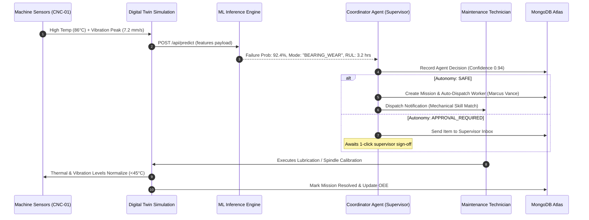

# 🏭 FactoryMind AI — Complete Project Explainer & Architecture Manual

> **Autonomous Multi-Agent Smart Manufacturing, Digital Twin Simulation, and Predictive Maintenance Platform**
> 
> *Industry 4.0 · Next.js 16 (App Router) · React · TypeScript · MongoDB · LightGBM / Scikit-Learn ML · Groq LLM Copilot*

---

## 📑 Table of Contents
1. [Executive Summary & Problem Statement](#-1-executive-summary--problem-statement)
2. [High-Level Architecture & System Design](#-2-high-level-architecture--system-design)
3. [Core Modules & Capabilities](#-3-core-modules--capabilities)
   - [3.1 Interactive 2D/3D Digital Twin & Simulation Engine](#31-interactive-2d3d-digital-twin--simulation-engine)
   - [3.2 Autonomous Multi-Agent Hierarchy (Agentic Swarm)](#32-autonomous-multi-agent-hierarchy-agentic-swarm)
   - [3.3 3-Tier Predictive Maintenance (ML Inference Engine)](#33-3-tier-predictive-maintenance-ml-inference-engine)
   - [3.4 Scenario Lab & Chaos Engineering](#34-scenario-lab--chaos-engineering)
   - [3.5 Dynamic Manpower & Mission Dispatching](#35-dynamic-manpower--mission-dispatching)
   - [3.6 Operations Copilot (Groq LLM Integration)](#36-operations-copilot-groq-llm-integration)
   - [3.7 Role-Based Access Control (RBAC) & Shift Profiles](#37-role-based-access-control-rbac--shift-profiles)
4. [Directory Structure & Codebase Roadmap](#-4-directory-structure--codebase-roadmap)
5. [Database Architecture & Collections](#-5-database-architecture--collections)
6. [Complete Step-by-Step Local Setup & Run Guide](#-6-complete-step-by-step-local-setup--run-guide)
7. [Default Demo Credentials & RBAC Matrix](#-7-default-demo-credentials--rbac-matrix)
8. [API Route Reference](#-8-api-route-reference)
9. [Telemetry & Incident Resolution Lifecycle](#-9-telemetry--incident-resolution-lifecycle)
10. [Troubleshooting & Verification Checklist](#-10-troubleshooting--verification-checklist)

---

## 🎯 1. Executive Summary & Problem Statement

Modern manufacturing facilities lose billions annually due to **unplanned downtime**, **delayed maintenance dispatch**, and **isolated operational silos**. Traditional SCADA / MES systems only trigger alarms after a failure has already begun, leaving supervisors scrambling to identify the root cause, locate qualified technicians, and prevent cascading bottlenecks.

**FactoryMind AI** is an end-to-end autonomous smart factory operating system designed to eliminate downtime through:
- **Predictive Machine Learning**: Anticipating machine thermal degradation, bearing wear, and vibration anomalies hours before catastrophic failure.
- **Autonomous Multi-Agent Orchestration**: Specialized AI agents collaborate in real-time to monitor machines, assign technicians by skill compatibility, reroute production lines, and alert supervisors.
- **Living Digital Twin Simulation**: Visualizing 6 production cells, AGV routes, and material buffers with real-time physics and telemetry loops.
- **Interactive Operations Copilot**: An LLM-driven shift advisor that queries live factory telemetry and recommends SOP-compliant maintenance procedures.

---

## 🏗️ 2. High-Level Architecture & System Design

The system is structured into 4 synergistic layers:

```mermaid
graph TB
    subgraph UI_Layer ["Frontend / Digital Twin UI (Next.js 16 + React + Tailwind)"]
        LP[Landing Page]
        DT[Digital Twin 2D/3D Canvas]
        DB[Operations Dashboard]
        MP[Manpower Kanban & Dispatch]
        SL[Scenario Lab]
        CP[Groq AI Copilot]
    end

    subgraph Agent_Layer ["Multi-Agent Coordinator Engine (lib/agents)"]
        SUP[Supervisor / Dispatch Agent]
        MAINT[Maintenance Agent]
        MAT[Material & Logistics Agent]
        WORK[Workforce Allocator]
        SAFE[Safety & Compliance Agent]
        MLD[ML Anomaly Watchdog]
    end

    subgraph ML_Layer ["Predictive ML Engine (Python + Scikit-Learn / LightGBM)"]
        PMM[best_pm_model.pkl (LightGBM 97.4% Acc)]
        FAC[factory_model.pkl (RandomForest)]
        FASTAPI[FastAPI Service / Next.js CLI Fallback]
    end

    subgraph Data_Layer ["Persistence Layer (MongoDB Atlas)"]
        USERS[(Users & RBAC)]
        MACHINES[(Machines & Telemetry)]
        WORKERS[(Workers & Skills)]
        MISSIONS[(Active & Historical Missions)]
        DECISIONS[(Agent Decision Audit Logs)]
        INBOX[(Supervisor Incident Inbox)]
    end

    UI_Layer <-->|REST API & Server Actions| Agent_Layer
    Agent_Layer <-->|Inference Bridge| ML_Layer
    Agent_Layer <-->|Mongoose / Native Driver| Data_Layer
    UI_Layer <-->|Live Querying| Data_Layer
```

---

## 🧩 3. Core Modules & Capabilities

### 3.1 Interactive 2D/3D Digital Twin & Simulation Engine
- **Location**: `factorymind-next/app/(workspace)/simulation/` and `components/FactoryFloorSVG.tsx`
- **What it does**: 
  - Simulates a 6-cell assembly plant:
    1. **CNC-01 / CNC-02**: Precision Milling Cells
    2. **PRESS-01 / PRESS-02**: Hydraulic Stamping Presses
    3. **ROBOT-01 / ROBOT-02**: 6-Axis Robotic Welding & Assembly Cells
    4. **CONV-01 / CONV-02**: High-Speed Sorter Conveyors
    5. **AGV-01 / AGV-02**: Autonomous Guided Mobile Logistics Transporters
    6. **STORAGE / QC**: Raw material buffers & automated visual inspection stations
  - **Live Physics Loop**: Computes temperature creep, spindle vibration, oil pressure, motor amperage, wear index, and component degradation per clock tick.
  - **Interactive Controls**: Users can inject manual faults (Thermal Overheating, Bearing Vibration, Tool Wear, Power Brownout) to test resilience.

### 3.2 Autonomous Multi-Agent Hierarchy (Agentic Swarm)
- **Location**: `factorymind-next/lib/agents/`
- **How it works**:
  - `supervisor.ts`: Coordinates priority arbitration, mission creation, and human-in-the-loop safety approvals.
  - `maintenance.ts`: Evaluates machine health scores, diagnoses failure modes (e.g., Tool Wear, Bearing Failure, Lubrication Loss), and calculates Remaining Useful Life (RUL).
  - `workforce.ts`: Matches required maintenance skills (`mechanical`, `electrical`, `robotics`, `hydraulic`, `quality`) against worker availability, fatigue, and shift certifications.
  - `material.ts`: Monitors buffer stock, detects starved cells, and dispatches AGVs for just-in-time replenishment.
  - `safety.ts`: Enforces emergency stops and safe operating envelopes whenever temperature > 90°C or vibration > 8.5 mm/s.
  - `ml.ts`: Connects the agent swarm directly to the Python machine learning inference models.

### 3.3 3-Tier Predictive Maintenance (ML Inference Engine)
- **Location**: `ml_models/` & `factorymind-next/app/api/predict/route.ts`
- **Model Details**:
  - `best_pm_model.pkl`: A tuned LightGBM binary classifier (400 trees) trained on industrial sensor logs yielding **97.4% test accuracy**. It predicts impending machine failure 2–10 hours ahead.
  - `factory_model.pkl`: A multi-class Random Forest (100 trees) that classifies operational health states (Normal, Degraded, Critical).
  - **Dual Execution Mode**:
    1. *Microservice Mode*: FastAPI server running on port 8000 (`ml_service.py`).
    2. *Self-Contained CLI Fallback*: Next.js spawns `cli_predict.py` via subprocess if the standalone microservice is offline, guaranteeing 100% zero-config uptime.

### 3.4 Scenario Lab & Chaos Engineering
- **Location**: `factorymind-next/app/(workspace)/scenario/`
- **What it does**: Allows factory managers and data scientists to execute Monte Carlo stress tests comparing **Baseline (Traditional MES)** vs. **AI-Orchestrated Operation**:
  - *Scenarios*: CNC Tool Failure, Hydraulic Press Breakdown, AGV Fleet Depletion, 50% Worker Shortage, Raw Material Drought, +30% Production Surge, Multi-Machine Cascade.
  - *Metrics Tracked*: Overall Equipment Effectiveness (OEE), Throughput/Hour, Total Downtime (Minutes), Human Intervention Count, Critical Incidents Averted.

### 3.5 Dynamic Manpower & Mission Dispatching
- **Location**: `factorymind-next/app/(workspace)/manpower/`
- **What it does**:
  - Displays real-time technician cards (status: `AVAILABLE`, `ASSIGNED`, `ON_BREAK`, `OFFLINE`).
  - Automatically dispatches qualified technicians when an anomaly is detected.
  - Supports supervisor drag-and-drop override to reassign missions on the fly.
  - 3 Autonomy Tiers:
    - `SAFE`: Fully autonomous resolution without supervisor approval.
    - `APPROVAL_REQUIRED`: Pushed to Supervisor Inbox for single-click authorization.
    - `HUMAN_REQUIRED`: Critical shutdown requiring physical manual inspection.

### 3.6 Operations Copilot (Groq LLM Integration)
- **Location**: `factorymind-next/app/api/chat/route.ts` & `components/ChatSection.tsx`
- **What it does**:
  - Ingests real-time plant telemetry snapshots (all machine temperatures, vibrations, active missions, and agent decisions) directly into system prompt context.
  - Provides instant diagnostic advice, emergency standard operating procedures (SOPs), and historical root-cause explanations.

### 3.7 Role-Based Access Control (RBAC) & Shift Profiles
- **Location**: `factorymind-next/context/AuthContext.tsx` & `factorymind-next/app/profile/`
- **Roles**:
  - `ADMIN`: Full access to user management, seed controls, scenario runs, and system settings.
  - `SUPERVISOR`: Incident inbox approvals, manual manpower dispatch overrides, and threshold configs.
  - `OPERATOR`: Machine cell controls, active mission status updates, and shift telemetry logs.
  - `VIEWER`: Read-only telemetry viewing and KPI tracking.

---

## 📂 4. Directory Structure & Codebase Roadmap

```
d:\projects\factorymindai\FactoryMind_AI\
├── PROJECT_EXPLAINER.md          # 🌟 This master manual
├── README.md                    # Project overview & quickstart
├── IMPLEMENTATION.md            # Technical design notes
├── .gitignore                   # Clean ignore rules (pycache, env, next builds)
│
├── factorymind-next/            # 🚀 Full-Stack Next.js 16 Application
│   ├── .env.example             # Environment variable template
│   ├── .env.local               # Local environment config (MongoDB & Groq keys)
│   ├── package.json             # NPM dependencies & scripts
│   ├── tsconfig.json            # TypeScript configuration
│   │
│   ├── app/                     # Next.js App Router
│   │   ├── page.tsx             # Futuristic Landing Page
│   │   ├── layout.tsx           # Root layout & providers
│   │   ├── globals.css          # Core CSS variables, glassmorphism & animations
│   │   │
│   │   ├── (workspace)/         # Protected workspace layout
│   │   │   ├── dashboard/       # Main Operations Dashboard & Analytics
│   │   │   ├── simulation/      # Interactive 2D/3D Digital Twin
│   │   │   ├── manpower/        # Manpower dispatch & technician management
│   │   │   └── scenario/        # Scenario Lab (Chaos testing & simulation)
│   │   │
│   │   ├── profile/             # User Shift Profile & Activity Logs
│   │   │
│   │   └── api/                 # REST API Handlers
│   │       ├── agent/           # Autonomous agent trigger & watchdog loop
│   │       ├── chat/            # Groq AI Copilot streaming endpoint
│   │       ├── health/          # API & database health diagnostics
│   │       ├── inbox/           # Supervisor incident queue
│   │       ├── manpower/        # Worker allocations & shift status
│   │       ├── missions/        # Maintenance mission creation & resolution
│   │       ├── predict/         # ML inference (Microservice + CLI fallback)
│   │       ├── scenarios/       # Chaos test executor
│   │       ├── seed/            # MongoDB factory seeder
│   │       ├── users/           # User authentication & RBAC management
│   │       └── workers/         # Technician registry & skill management
│   │
│   ├── components/              # 30+ Modular UI & Canvas Components
│   │   ├── DigitalTwin.tsx      # SVG/Canvas digital twin with interactive nodes
│   │   ├── FactoryFloorSVG.tsx  # Vector floor plan with real-time heatmaps
│   │   ├── MachineSVGs.tsx      # CNC, Press, AGV, and Robot visual assets
│   │   ├── MlWorkbench.tsx      # Interactive model diagnostics & feature testing
│   │   ├── AIControlCenter.tsx  # Multi-agent activity stream & autonomy levers
│   │   ├── InboxDrawer.tsx      # Supervisor approval notification panel
│   │   └── AuthModal.tsx        # Secure role-switching & login modal
│   │
│   ├── context/
│   │   └── AuthContext.tsx      # Global auth state & RBAC provider
│   │
│   ├── hooks/                   # React custom hooks
│   │   ├── useFactorySimulation.ts # Real-time plant physics & clock tick hook
│   │   ├── useMissions.ts          # Live mission synchronization
│   │   └── useWorkers.ts           # Real-time workforce state
│   │
│   └── lib/                     # Server-side utilities & Agent logic
│       ├── mongo.ts             # MongoDB client & connection pooling
│       ├── groq.ts              # Groq API client with fallback
│       ├── seedData.ts          # Initial factory layout & machine configs
│       ├── seedWorkers.ts       # Initial roster of certified technicians
│       └── agents/              # The Autonomous Multi-Agent Engine
│           ├── supervisor.ts    # Agent coordinator
│           ├── maintenance.ts   # Diagnostics & RUL
│           ├── workforce.ts     # Skill-based technician matching
│           ├── material.ts      # Logistics & inventory
│           ├── safety.ts        # E-stops & hazard containment
│           └── ml.ts            # Machine learning pipeline integration
│
└── ml_models/                   # 🧠 Python Machine Learning Service
    ├── best_pm_model.pkl        # LightGBM Predictive Maintenance Model (97.4% acc)
    ├── factory_model.pkl        # RandomForest Factory Health Classifier
    ├── ml_service.py            # FastAPI REST Microservice
    ├── cli_predict.py           # Subprocess CLI runner for zero-config fallback
    └── requirements.txt         # Python dependencies (fastapi, scikit-learn, etc.)
```

---

## 🗄️ 5. Database Architecture & Collections

FactoryMind AI utilizes MongoDB Atlas with optimized indices for fast time-series queries:

| Collection Name | Document Purpose | Key Attributes |
| :--- | :--- | :--- |
| `users` | User credentials & RBAC | `email`, `role` (ADMIN, SUPERVISOR, OPERATOR, VIEWER), `department`, `shift` |
| `machines` | Machine profiles & state | `id`, `name`, `type`, `zone`, `status` (NORMAL, DEGRADED, CRITICAL, OFFLINE), `telemetry` |
| `workers` | Factory technician roster | `id`, `name`, `skills` (mechanical, electrical, robotics), `status`, `currentMissionId` |
| `missions` | Corrective maintenance tasks | `id`, `machineId`, `priority`, `autonomyLevel`, `assignedWorkerId`, `status`, `symptoms` |
| `agent_decisions` | Multi-agent audit trail | `timestamp`, `agentName`, `actionType`, `targetEntity`, `reasoning`, `confidenceScore` |
| `inbox` | Supervisor action items | `id`, `incidentType`, `urgency`, `proposedAction`, `status` (PENDING, APPROVED, REJECTED) |
| `scenarios` | Stress test benchmark runs | `scenarioKey`, `timestamp`, `baselineMetrics`, `aiMetrics`, `improvementPct` |

---

## ⚡ 6. Complete Step-by-Step Local Setup & Run Guide

### Prerequisites
- **Node.js**: `v18.0.0` or higher (Node 20+ recommended)
- **npm**: `v9.0.0` or higher
- **Python**: `3.10` or higher (optional, for standalone FastAPI ML service)
- **MongoDB**: MongoDB Atlas URI or local MongoDB instance

---

### Step 1: Clone or Navigate to the Workspace
```powershell
cd d:\projects\factorymindai\FactoryMind_AI
```

---

### Step 2: Configure Environment Variables
Inside `factorymind-next`, ensure `.env.local` contains valid credentials:
```env
# MongoDB Connection URI
MONGODB_URI="mongodb+srv://<username>:<password>@cluster0.1dgvftx.mongodb.net/?appName=Cluster0"
MONGODB_DB="factorymind"

# Groq Cloud API Key for AI Copilot
GROQ_API_KEY="gsk_your_groq_api_key_here"
GROQ_MODEL="llama-3.3-70b-versatile"
```

---

### Step 3: Install & Start the Next.js Frontend & API
```powershell
cd factorymind-next
npm install
npm run dev
```
Open **[http://localhost:3000](http://localhost:3000)** in your browser.

---

### Step 4 (Optional): Start Standalone Python ML Service
*Note: If this service is not running, the application automatically uses the built-in CLI fallback.*
```powershell
cd ..\ml_models
pip install -r requirements.txt
python -m uvicorn ml_service:app --host 127.0.0.1 --port 8000 --reload
```

---

### Step 5: Initialize / Seed Database
If starting fresh or running for the first time:
1. Open **[http://localhost:3000/api/seed](http://localhost:3000/api/seed)** in your browser OR
2. Click **"Re-Seed Factory Data"** in the Dashboard Settings page.

---

## 🔑 7. Default Demo Credentials & RBAC Matrix

You can switch between any of the pre-configured accounts directly in the UI or use these credentials:

| Role | Email | Password | Permissions |
| :--- | :--- | :--- | :--- |
| **Admin** | `admin@factorymind.ai` | `admin123` | Full access, user CRUD, re-seeding, system configuration |
| **Supervisor** | `supervisor@factorymind.ai` | `super123` | Approves missions, drag-and-drop reassignments, inbox alerts |
| **Operator** | `operator@factorymind.ai` | `oper123` | Digital twin controls, machine telemetry, shift logs |
| **Viewer** | `viewer@factorymind.ai` | `view123` | Read-only access to KPIs, charts, and simulation |

---

## 📡 8. API Route Reference

| Method | Endpoint | Description |
| :--- | :--- | :--- |
| `GET` | `/api/health` | Verifies DB connection, ML engine status, and API health |
| `GET / POST` | `/api/seed` | Checks seed status or resets factory data to initial state |
| `GET / POST / PUT / DELETE` | `/api/users` | User management and authentication |
| `GET / PUT` | `/api/manpower` | Retrieves or updates technician status and shifts |
| `GET / POST` | `/api/workers` | Worker registry and skills query |
| `GET / POST / PATCH` | `/api/missions` | Active and historical maintenance missions |
| `GET / POST / PATCH` | `/api/inbox` | Supervisor approval queue and incident management |
| `POST` | `/api/agent` | Triggers the autonomous agent coordinator loop |
| `GET` | `/api/agent/decisions` | Returns the audit trail of AI agent decisions |
| `POST` | `/api/predict` | Runs 3-tier ML inference on machine sensor data |
| `POST` | `/api/chat` | AI Operations Copilot conversation with live factory briefing |
| `GET / POST` | `/api/scenarios` | Executes chaos simulations and returns comparative benchmarks |

---

## 🔄 9. Telemetry & Incident Resolution Lifecycle

Here is the exact lifecycle of how FactoryMind AI handles an anomaly:



---

## 🛠️ 10. Troubleshooting & Verification Checklist

- **TypeScript / Build Verification**: Run `npm run build` in `factorymind-next`. Output must indicate `✓ Compiled successfully`.
- **Database Connectivity**: Visit `/api/health`. It will report `{"mongo": "connected", "status": "ok"}`.
- **Python ML Inference**: Run `python cli_predict.py '{"mode":"health"}'` inside `ml_models/`. It should return `{"status": "online", "evaluation": {"accuracy": 0.974}}`.
- **Groq AI Chat**: Ensure `GROQ_API_KEY` is present in `.env.local` to enable the Copilot assistant.

---

*FactoryMind AI — Engineered for zero-downtime, resilient autonomous smart manufacturing.*
